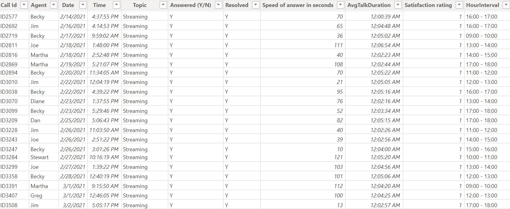

# PhoneNow-KPI-Dashboard

## Introduction
This is a **Power BI project** on call center performance analysis for an imaginary telecom organization called **PhoneNow**. The project aims to evaluate the efficiency and effectiveness of the call center operations by analyzing key metrics such as **overall customer satisfaction**, **calls answered vs. abandoned**, **average speed of answer**, and individual **agent performance**.
The goal is to identify trends, address inefficiencies, and provide actionable insights that can enhance customer service quality, optimize resource allocation, and improve overall call resolution rates. This analysis also includes recommendations to better manage peak hours, reward top-performing agents, and address common customer issues more efficiently.

## Problem Statement
PhoneNow is facing challenges in optimizing its call center operations to meet growing customer demands and maintain high satisfaction levels. Key issues include:

- Identifying trends in call volumes and agent performance.
- Understanding factors affecting customer satisfaction and resolution rates.
- Reducing unanswered and abandoned calls during peak hours.

The primary objective is to provide actionable insights that enhance service quality, optimize resource allocation during peak hours, and support the development of strategies to improve overall call center performance.

## Data Exploration

| **Column**             | **Description**                                                                                       |
|-------------------------|-------------------------------------------------------------------------------------------------------|
| **Call Id**            | Unique identifier for each call.                                                                     |
| **Agent**              | Name of the call center agent handling the call.                                                     |
| **Date**               | Date the call was made.                                                                              |
| **Time**               | Exact time the call was initiated.                                                                   |
| **Topic**              | Main issue discussed during the call.                                                                |
| **Answered (Y/N)**     | Indicates whether the call was answered (Y) or not (N).                                              |
| **Resolved (Y/N)**     | Indicates whether the issue was resolved during the call (Y) or not (N).                              |
| **Speed of Answer (seconds)** | Time taken (in seconds) for the agent to answer the call after it was initiated.                   |
| **Avg Talk Duration**  | Average duration of the call in hours, minutes, and seconds.                                         |
| **Satisfaction Rating** | Customer's rating of the call experience on a scale of 1-5.                                          |

## METHODOLOGY
### Data Preparation and Transformation
1. ETL Process: Data was extracted, transformed, and loaded into Power BI.
2. Data Cleaning: Replaced missing values, standardized column formats, and added conditional columns.
3. Calculated Measures: Developed custom DAX measures for KPIs.
4. Filters and Slicers: Enabled filtering by Agent, Topic, and Time Period for dynamic analysis.

### Data Modelling
To enable robust time intelligence and facilitate a detailed analysis of the performance of the call center, the data preparation process was conducted with precision and attention to detail. Key activities included:  

- **Calendar Table Development**: A custom calendar table was created to support advanced time-based analytics.  
- **Dataset Integration**: The calendar table was seamlessly integrated with the marketing campaign datasets for cohesive analysis.  
- **Relationship Mapping**: Relationships were established between the calendar table and other data tables through shared date columns, ensuring consistent linkage.  
- **Data Model Validation**: A thorough review of the data model was conducted to confirm data integrity and ensure the accuracy of relationships.  

This structured approach laid the groundwork for meaningful insights through accurate and comprehensive visualizations.

## Data Model

## Raw Data Preview

## Report Structure
The dashboard consists of two pages for focused analysis:

1. Call Center Performance Overview: Provides high-level metrics, including total calls, abandonment rates, busiest hours, and topic distribution.

2. Agent Performance and Topic Analysis: Focuses on individual agent performance, satisfaction ratings, handle time, and a detailed breakdown of topics handled by the call center.
